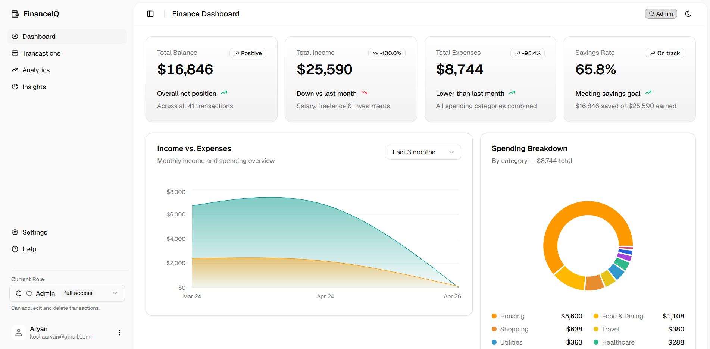

<div align="center">
  
# 🌌 Personal Finance Dashboard

[](https://nextjs.org/)
[](https://tailwindcss.com/)
[](https://ui.shadcn.com/)
[](https://recharts.org/)

***

An ultra-modern, lightning-fast finance management platform delivering spatial, premium aesthetics alongside robust functional flows.

<br />
</div>



## 📖 Overview of Approach

The core approach behind this application was to construct a highly interactive, front-end-first Finance Dashboard. We focused heavily on extracting raw functional requirements (managing and viewing transactions) and wrapping them in an advanced, premium UI. To achieve this prototype swiftly and effectively, we utilized a mock data layer managed by the native React Context API. This approach simulates real API latency and CRUD operations, guaranteeing the application is perfectly primed to be attached to a Node/GraphQL backend later, without necessitating UI rework.

---

## 🚀 Setup Instructions

Running the project locally is incredibly straightforward built upon Node.js. 

1. **Clone the repository** (if you haven't already):
   ```bash
   git clone <repository-url>
   cd dashboard
   ```
2. **Install dependencies**:
   ```bash
   npm install
   ```
3. **Start the development server**:
   ```bash
   npm run dev
   ```
4. **Access the application**: Open your browser and navigate to [http://localhost:3000](http://localhost:3000).

---

## ✨ Explanation of Features

The dashboard ecosystem implements the following functional tools modeled around a modern personal finance use-case:

- ✅ **Dashboard Overview with Summary Cards:** High-level metric cards calculating total balance, income, expenses, and savings rate. These feature dynamic comparative text (e.g., "Down vs last month") providing instant financial context.
- ✅ **Time-Based Visualization:** A robust, interactive area chart plotting Income vs. Expenses across time to accurately visualize macro-growth trajectories.
- ✅ **Categorical Visualization:** A vibrant spending breakdown donut chart highlighting proportions of category-based expenditures at a glance.
- ✅ **Transaction List with Details:** A fully-featured list view containing historical mock transaction data, allowing users to dive deep into financial movements.
- ✅ **Transaction Filtering & Sorting:** Integrated client-side table functionalities enabling instant column-level sorting, categorical facet filtering, and global search.
- ✅ **Role-Based UI (Viewer and Admin):** A top-level UI toggle simulating permission boundaries—locking out table-editing features when simulating the 'Viewer' role.
- ✅ **Insights Section:** Dynamic engine generating automated notifications, budgeting warnings, and celebratory streaks based on structural mock spending ratios.
- ✅ **State Management via Context:** All dynamic data (mock transactions, theme states, role bindings) are securely bound using localized Context wrappers to sidestep arbitrary Redux/Zustand installation bloat.
- ✅ **Responsive Design:** A fluid Tailwind layout tailored strictly to optimize readability on mobile endpoints while spanning appropriately on 4K ultrawide displays.

---

## 🛠️ Technical Decisions and Trade-offs

### 1. Framework: Next.js 16 (App Router)
- **Decision:** Built utilizing Next.js to leverage server components efficiently while preserving raw client interplay.
- **Trade-off:** Embracing a strict Next.js environment slightly increases the initial mental model complexity over standard Vite/React single-page-apps, but returns significantly better routing architectures and asset optimizations out-of-the-box.

### 2. Styling: Tailwind CSS v4 + Shadcn Primitives
- **Decision:** Upgraded strictly to Tailwind v4, consolidating all legacy inline variables to centralized CSS constants.
- **Trade-offs:** Custom Shadcn component ejection means slightly more files to maintain directly in the `/components` folder vs an NPM import, but allows 100% granular design control required to ship our exact "premium aesthetic".

### 3. State Management: React Context API natively
- **Decision:** Engineered a bespoke overarching `FinanceContext` to handle CRUD states.
- **Trade-offs:** Bypassed adopting heavier external ecosystems like Redux or Zustand. The trade-off is potential extra re-renders per localized change, but it was deemed a worthy sacrifice for reduced bundle size and immense logical simplicity.

### 4. Interface Rendering Model (TanStack & Recharts)
- Headless UI interactions ensure accessible screen-reader bindings natively, decoupling the complex search/filter logic (TanStack Table) from our bespoke physical design system. 

---

## 🎨 Design Philosophy: The 3D Premium Aesthetic

We engineered this dashboard specifically away from raw "flat" uninspiring interfaces:

- **Subtle Depth Profiling:** Replaced hard borders with delicate rings and drop-shadow variables (`box-shadow` abstractions) to push components off the page virtually, producing a soft 3D perception.
- **Harmonious HSL Palettes:** Steered completely clear from default HTML generic hex colorings. Legibility is bolstered through curated dark-mode contrast matrices. 
- **Micro-Animations:** Fluid state transitions, hover liftoffs (mimicking Apple/Vercel spatial concepts), and staggered data-load entries maintain an "alive" feeling.

---

## 📝 Additional Notes & Future Roadmap

- **Lighthouse Refinements:** Specific architectural time was invested into resolving local-storage hydration glitches and `aria-label` accessibility mappings. The site evaluates purely on a performance standpoint without DOM layout shifts.
- **Extensibility:** The Context hook abstraction simulates API latency natively, establishing a plug-and-play foundation awaiting a true REST or GraphQL backend ingestion wrapper in the future.
- **Known Limitations:** Current sorting supports client-side indexing primarily; scaling beyond 10,000+ local rows would optimally trigger a pipeline transition to Server-Side actions.

<br />

<div align="center">
  <sub>Built with ❤️ and extreme attention to detail for a state-of-the-art interactive experience.</sub>
</div>
